# webgpu

Rust WebGPU examples porting [Sascha Willems' Vulkan samples](https://github.com/SaschaWillems/vulkan), with WASM and native support, based on the [Sib render module](https://github.com/PooyaEimandar/sib).

## Demo

Try the WASM demos [here](https://pooyaeimandar.github.io/webgpu/)

## Examples

| Example | Description | Screenshot |
| --- | --- | --- |
| `triangle` | Renders a colored indexed triangle using vertex and index buffers, WGSL vertex/fragment shaders, a render pipeline, and a depth attachment. | <picture><source srcset="screenshots/triangle.webp" type="image/webp">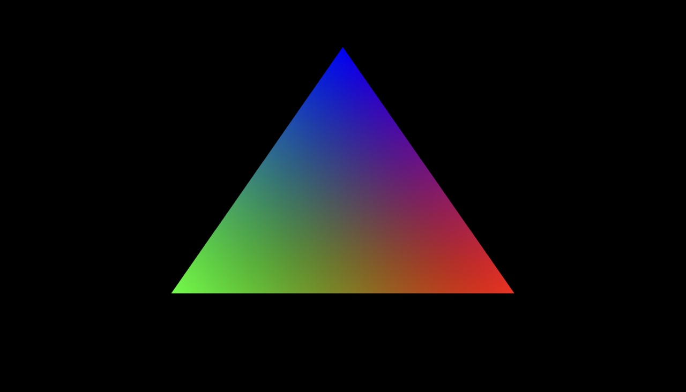</picture> |
| `vertexattributes` | Renders the same indexed mesh through interleaved and separate vertex attribute buffers using matching shader locations for position, normal, UV, and tangent data. | <picture><source srcset="screenshots/vertexattributes.webp" type="image/webp">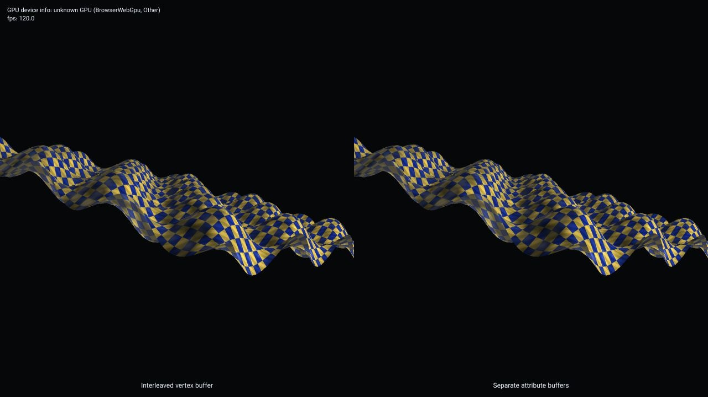</picture> |
| `particlesystem` | Updates flame and smoke particles on the CPU, streams them into an instance buffer, and renders billboard sprites over a normal-mapped scene. | <picture><source srcset="screenshots/particlesystem.webp" type="image/webp">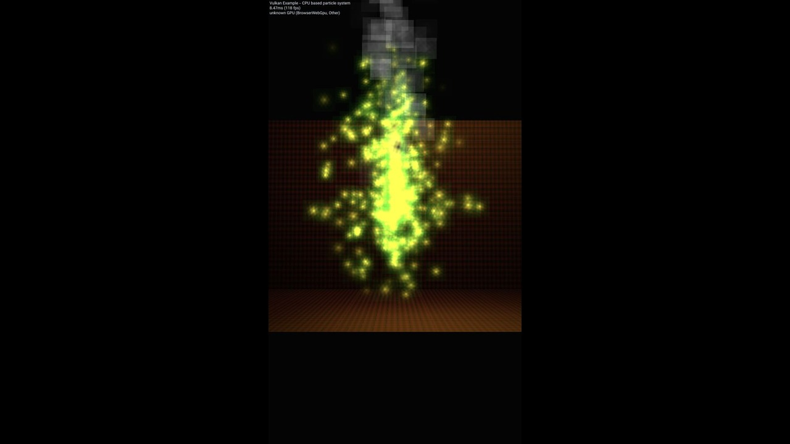</picture> |
| `texture` | Renders a textured indexed quad using a runtime-loaded PNG texture, a sampler, uniform buffer transforms, and fragment shader lighting. | <picture><source srcset="screenshots/texture.webp" type="image/webp">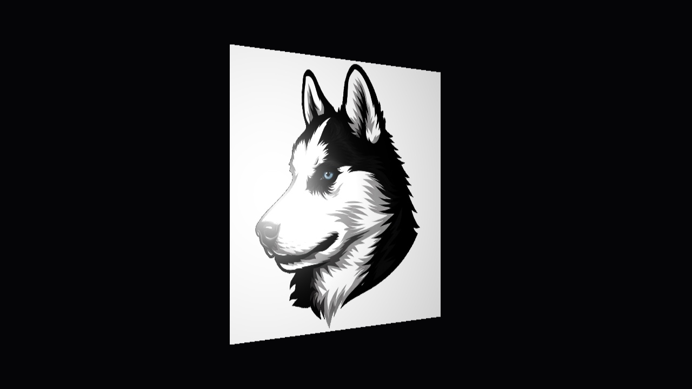</picture> |
| `texturecubemap` | Renders a skybox and reflective sphere from a runtime-loaded cubemap using six JPEG faces, a cube texture view, and a cube sampler. | <picture><source srcset="screenshots/texturecubemap.webp" type="image/webp">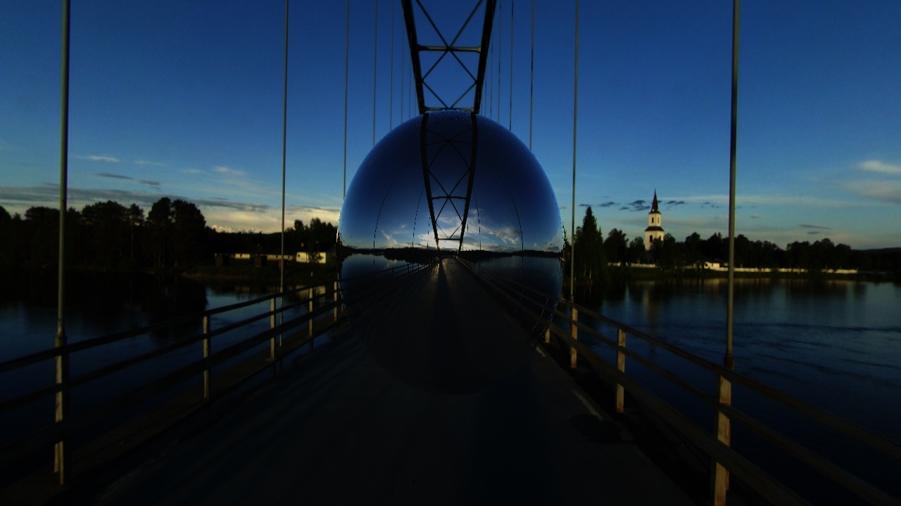</picture> |
| `texturearray` | Renders seven stacked squares sampling separate layers from a runtime-built 2D texture array with two async-loaded images, RGB layers, and procedural layers. | <picture><source srcset="screenshots/texturearray.webp" type="image/webp">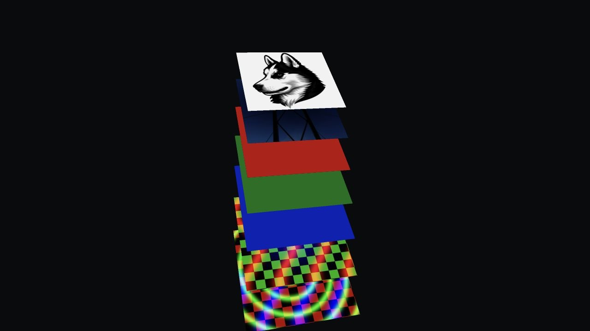</picture> |
| `textoverlay` | Renders glyph atlas text over a 3D scene using an overlay render pass, Unicode shaping, and RTL text. | <picture><source srcset="screenshots/textoverlay.webp" type="image/webp"></picture> |
| `textmesh` | Converts shaped LTR and RTL font outlines into extruded indexed mesh geometry with vertex colors and lighting. | <picture><source srcset="screenshots/textmesh.webp" type="image/webp"></picture> |
| `gltf` | Loads an official glTF 2.0 textured box from URL, converts buffers and material data to render meshes, and samples its base color texture. | <picture><source srcset="screenshots/gltf.webp" type="image/webp"></picture> |
| `gltfskinning` | Loads an animated glTF 2.0 character from URL, uploads joints and weights, and skins vertices in the WGSL vertex shader. | <picture><source srcset="screenshots/gltfskinning.webp" type="image/webp">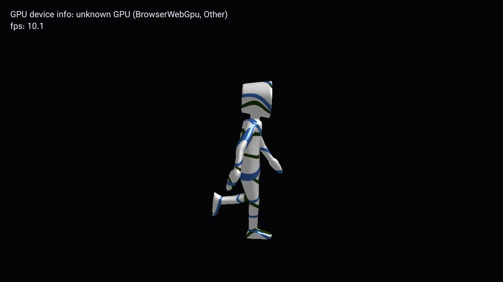</picture> |
| `instancing` | Renders thousands of asteroid instances from one indexed mesh, using a per-instance vertex buffer for transform data and a 2D texture array for material variation. | <picture><source srcset="screenshots/instancing.webp" type="image/webp">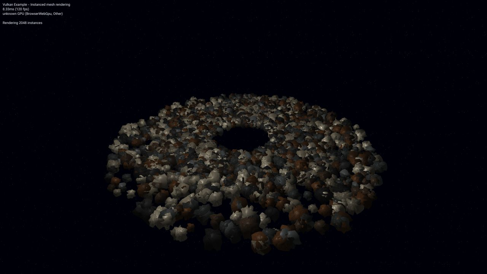</picture> |
| `indirectdraw` | Renders many instanced plant submeshes from indexed indirect command buffers, with a skysphere, ground mesh, and per-instance transforms. | <picture><source srcset="screenshots/indirectdraw.webp" type="image/webp">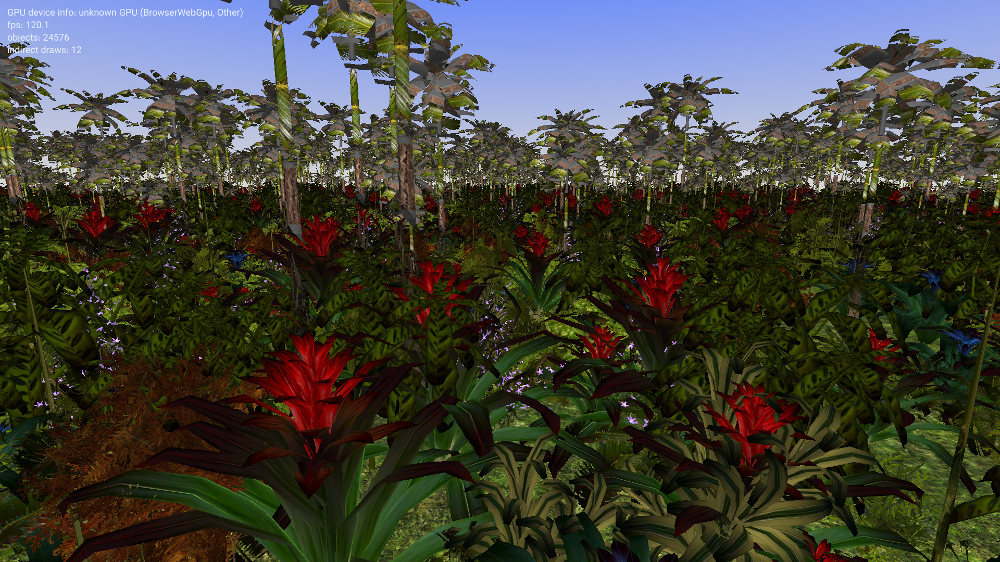</picture> |
| `pipelines` | Renders the original treasure glTF scene through Phong, toon, and wireframe render pipelines in separate viewports. | <picture><source srcset="screenshots/pipelines.webp" type="image/webp">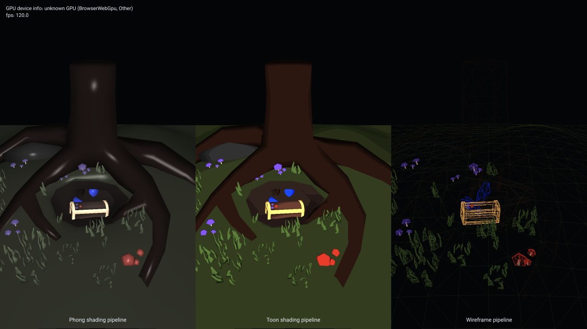</picture> |
| `gears` | Renders animated procedural toothed gears using indexed mesh buffers, per-gear uniform transforms, depth testing, and fragment shader lighting. | <picture><source srcset="screenshots/gears.webp" type="image/webp">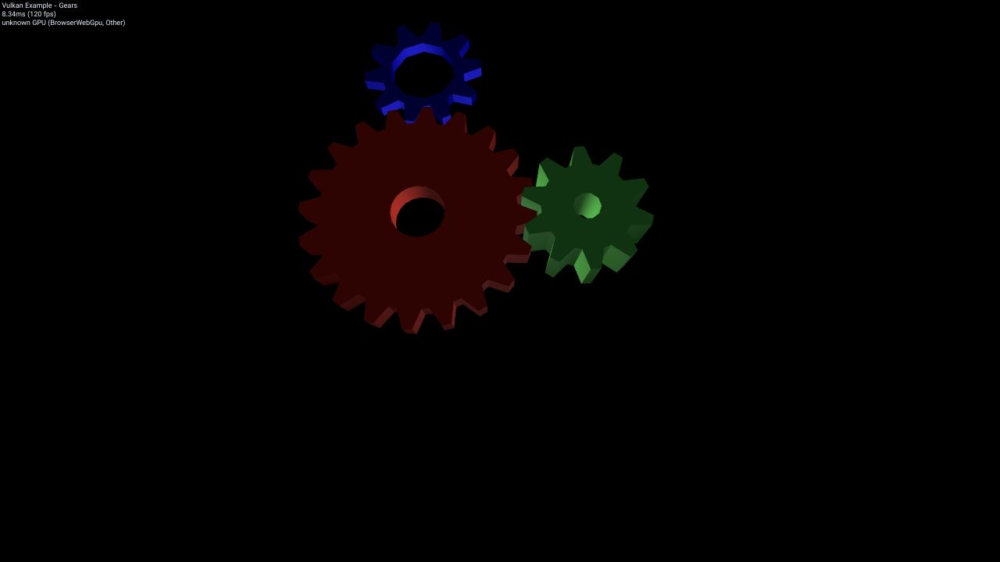</picture> |
| `stencilbuffer` | Renders a toon-shaded Venus mesh, writes stencil during the first draw, then draws a normal-expanded outline where stencil differs. | <picture><source srcset="screenshots/stencilbuffer.webp" type="image/webp">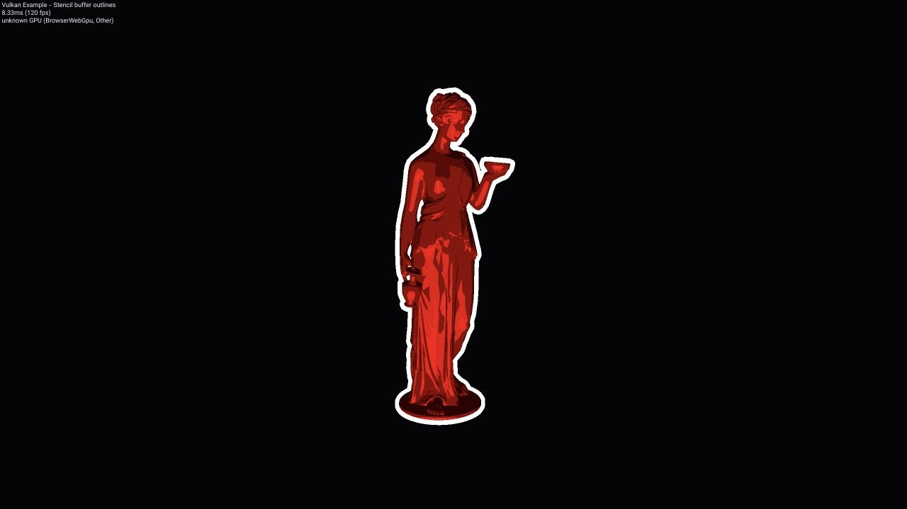</picture> |
| `occlusionquery` | Tests teapot and sphere visibility; native builds resolve occlusion-query samples, while WASM uses a browser-safe fallback and shades hidden meshes dark. | <picture><source srcset="screenshots/occlusionquery.webp" type="image/webp">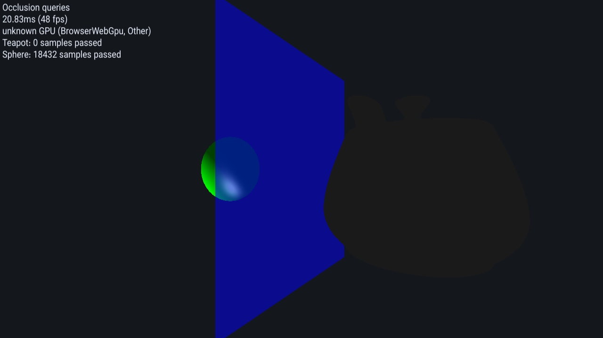</picture> |
| `radialblur` | Renders a glow sphere to an offscreen target, samples it in a fullscreen radial blur pass, and blends the result over the lit scene. | <picture><source srcset="screenshots/radialblur.webp" type="image/webp">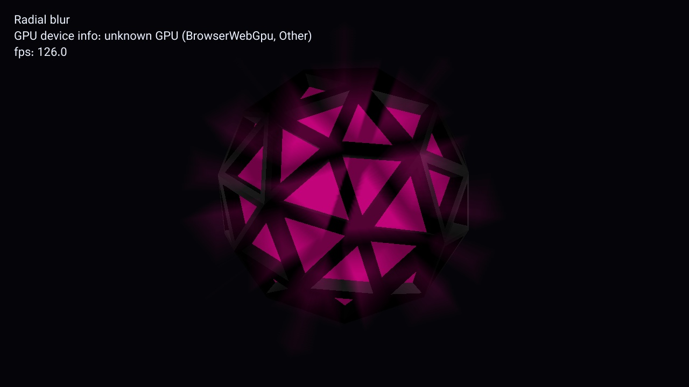</picture> |
| `bloom` | Renders glowing UFO parts to an offscreen target, runs separable Gaussian blur passes, and additively composites the bloom over the lit scene. | <picture><source srcset="screenshots/bloom.webp" type="image/webp">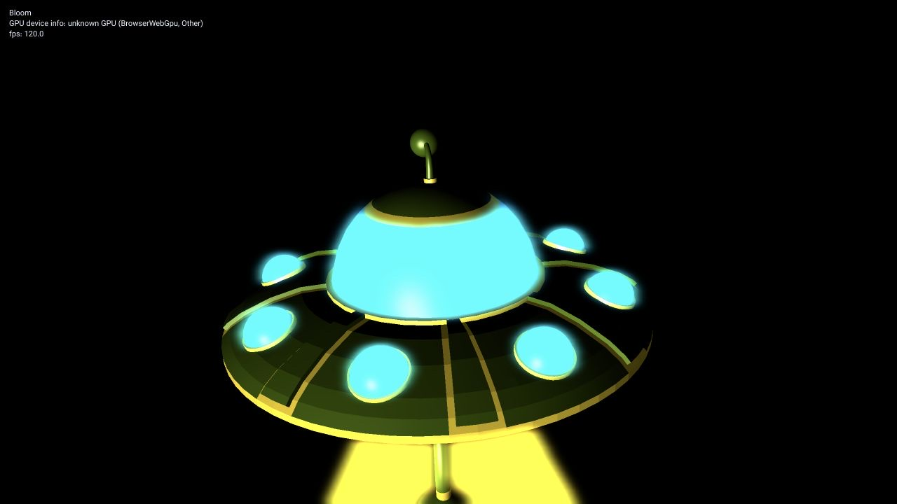</picture> |
| `shadowmapping` | Renders a depth-only light pass into a shadow map, then samples that depth texture in the scene pass for projected shadows with PCF filtering. | <picture><source srcset="screenshots/shadowmapping.webp" type="image/webp">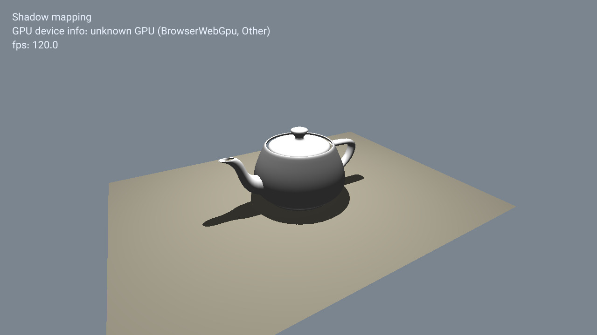</picture> |
| `shadowmappingcascade` | Splits the camera frustum into four cascades, renders each split into a depth texture array layer, and samples the selected layer for directional shadows. | <picture><source srcset="screenshots/shadowmappingcascade.webp" type="image/webp">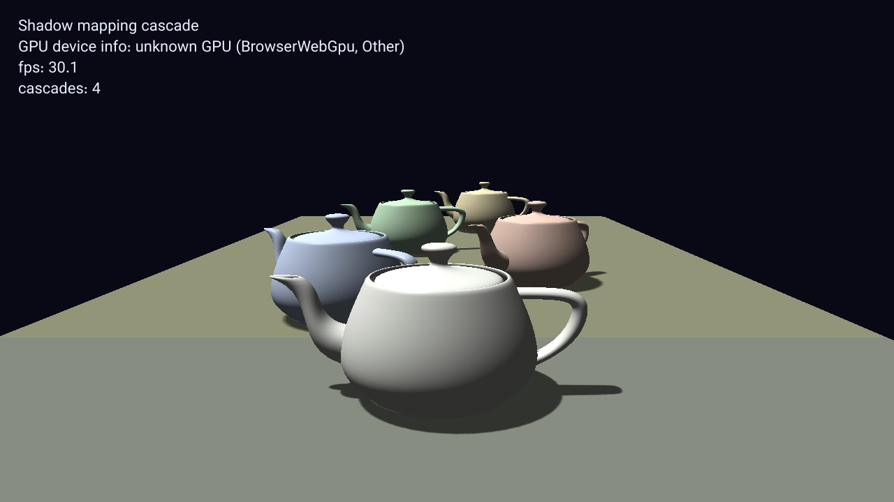</picture> |
| `shadowmappingomni` | Renders the scene into the six faces of a floating-point cube map, stores point-light distance, and samples it for omni-directional shadows. | <picture><source srcset="screenshots/shadowmappingomni.webp" type="image/webp">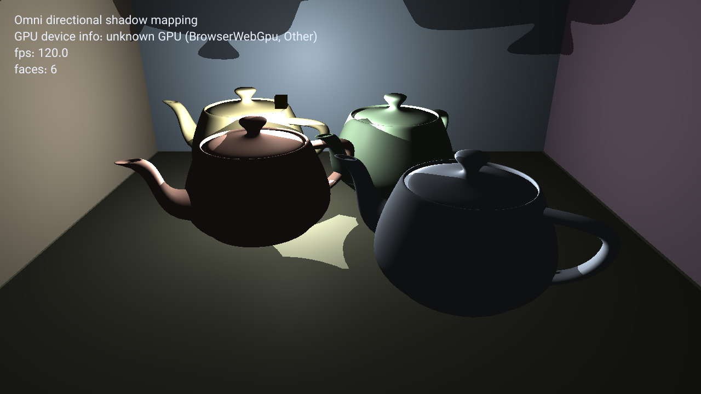</picture> |

## Running

Native:

```sh
cargo run --example triangle
```

WASM:

```sh
scripts/build-wasm.sh --release
cargo run --bin serve
```

Then open `http://127.0.0.1:8080`.
