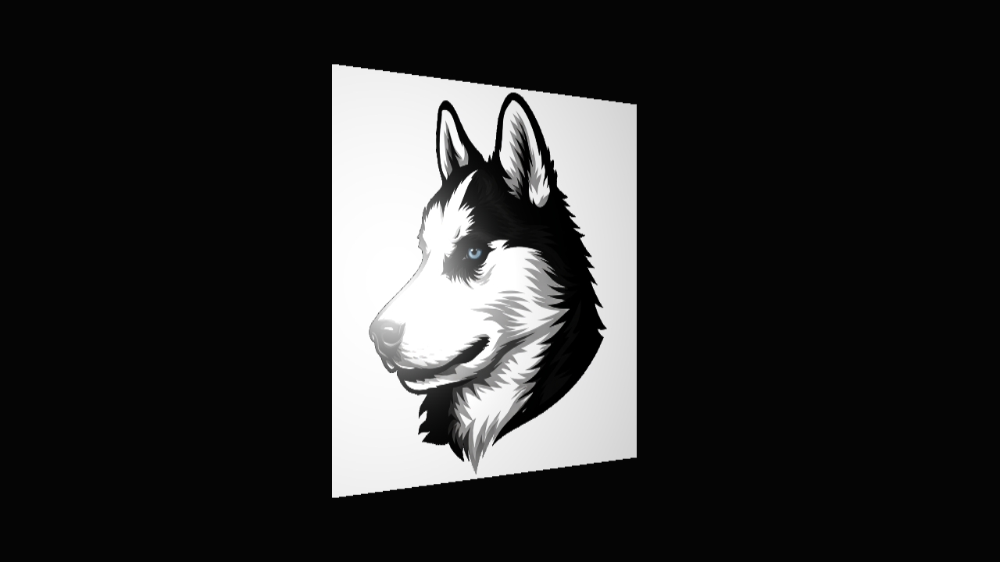
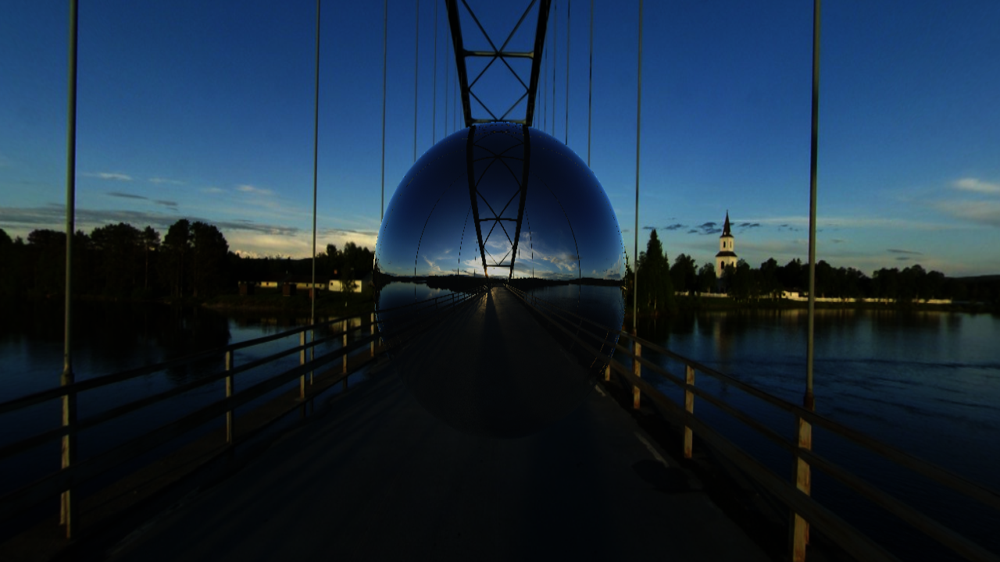
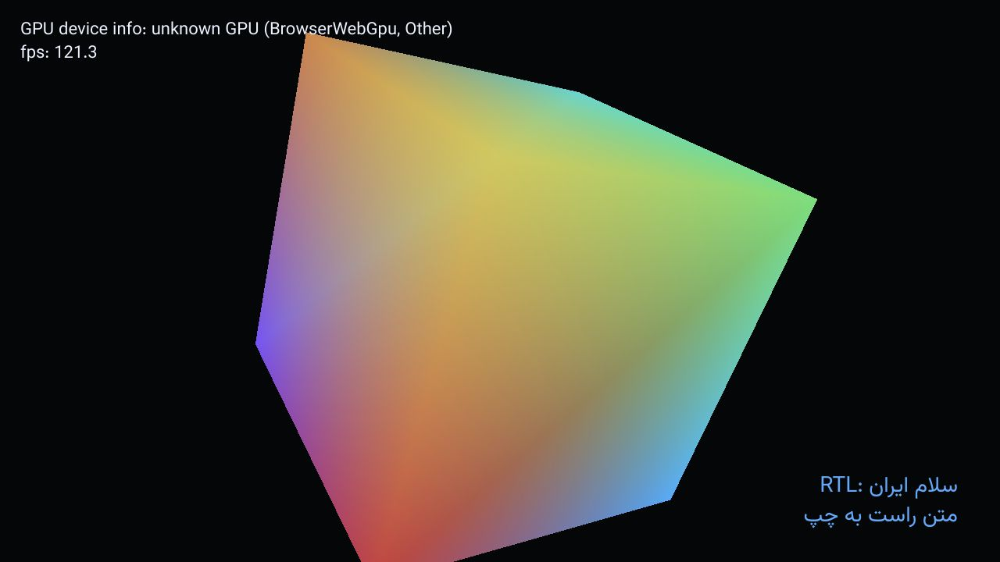
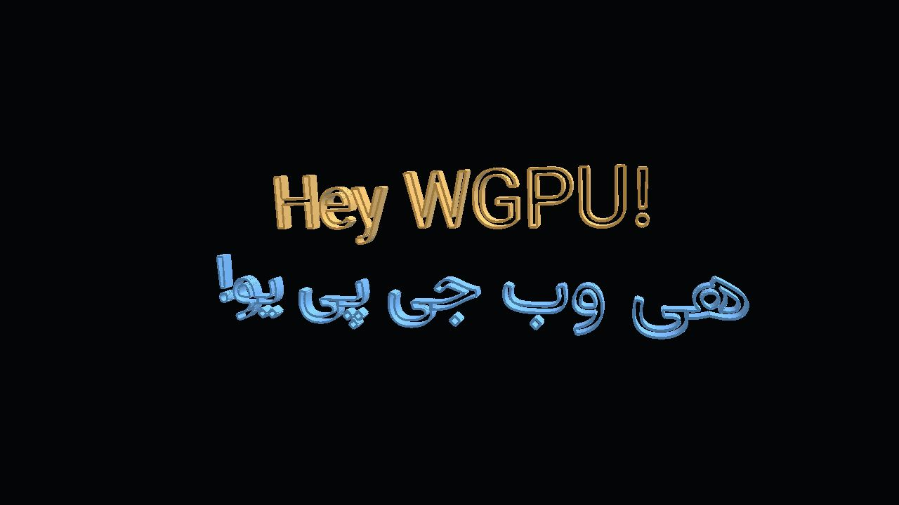
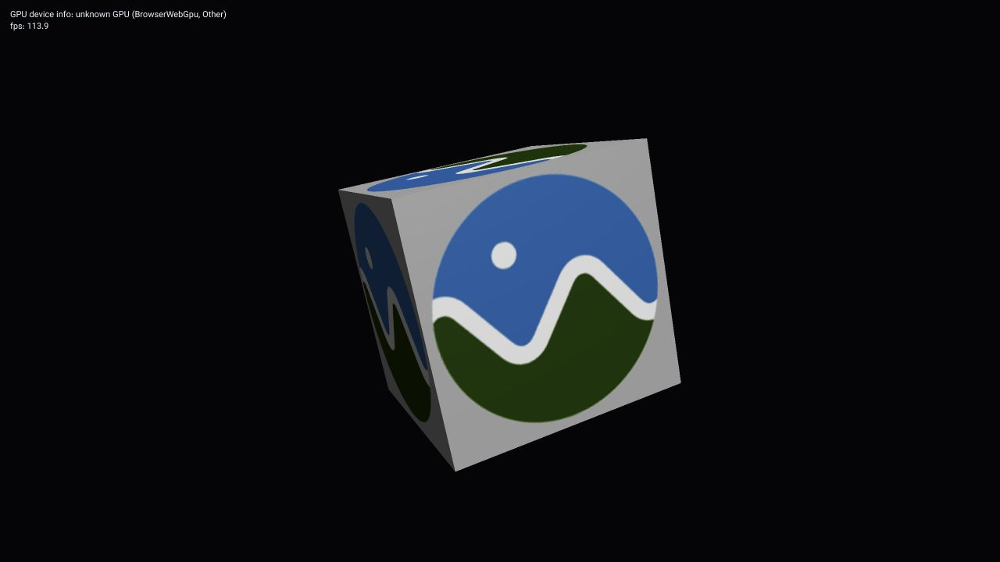
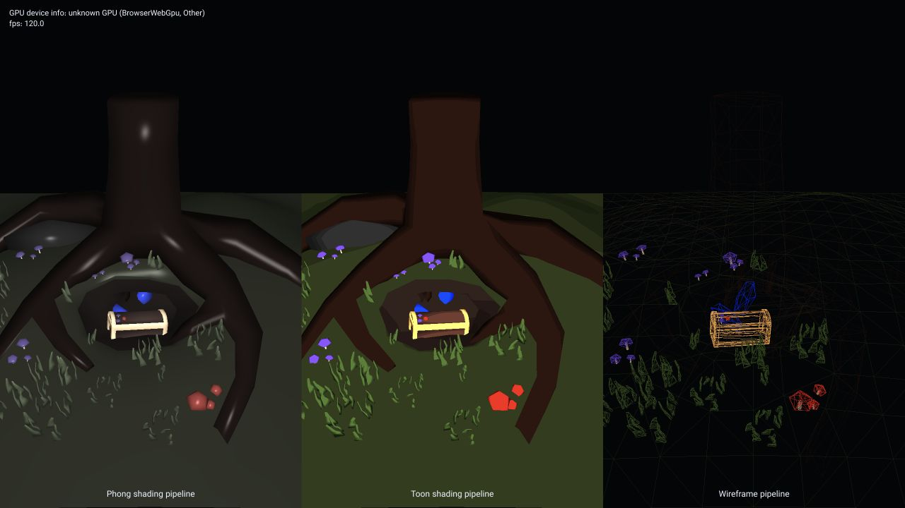

# webgpu

Rust WebGPU examples porting [Sascha Willems' Vulkan samples](https://github.com/SaschaWillems/vulkan), with WASM and native support, based on the [Sib render module](https://github.com/PooyaEimandar/sib).

## Demo

Try the WASM demos [here](https://pooyaeimandar.github.io/webgpu/)

## Examples

| Example | Description | Screenshot |
| --- | --- | --- |
| `triangle` | Renders a colored indexed triangle using vertex and index buffers, WGSL vertex/fragment shaders, a render pipeline, and a depth attachment. |  |
| `texture` | Renders a textured indexed quad using a runtime-loaded PNG texture, a sampler, uniform buffer transforms, and fragment shader lighting. |  |
| `texturecubemap` | Renders a skybox and reflective sphere from a runtime-loaded cubemap using six JPEG faces, a cube texture view, and a cube sampler. |  |
| `texturearray` | Renders seven stacked squares sampling separate layers from a runtime-built 2D texture array with two async-loaded images, RGB layers, and procedural layers. |  |
| `textoverlay` | Renders glyph atlas text over a 3D scene using an overlay render pass, Unicode shaping, and RTL text. |  |
| `textmesh` | Converts shaped LTR and RTL font outlines into extruded indexed mesh geometry with vertex colors and lighting. |  |
| `gltf` | Loads an official glTF 2.0 textured box from URL, converts buffers and material data to render meshes, and samples its base color texture. |  |
| `pipelines` | Renders the original treasure glTF scene through Phong, toon, and wireframe render pipelines in separate viewports. |  |
| `gears` | Renders animated procedural toothed gears using indexed mesh buffers, per-gear uniform transforms, depth testing, and fragment shader lighting. |  |
| `stencilbuffer` | Renders a toon-shaded Venus mesh, writes stencil during the first draw, then draws a normal-expanded outline where stencil differs. |  |

## Running

Native:

```sh
cargo run --example triangle
```

WASM:

```sh
scripts/build-wasm.sh --release
cargo run --bin serve
```

Then open `http://127.0.0.1:8080`.
