# webgpu

Rust WebGPU examples porting [Sascha Willems' Vulkan samples](https://github.com/SaschaWillems/vulkan), with WASM and native support, based on the [Sib render module](https://github.com/PooyaEimandar/sib).

## Demo

Try the WASM demos [here](https://pooya.ai/webgpu/)

## Examples

| Example | Description | Screenshot |
| --- | --- | --- |
| `triangle` | Renders a colored indexed triangle using vertex and index buffers, WGSL vertex/fragment shaders, a render pipeline, and a depth attachment. | <picture><source srcset="screenshots/triangle.webp" type="image/webp">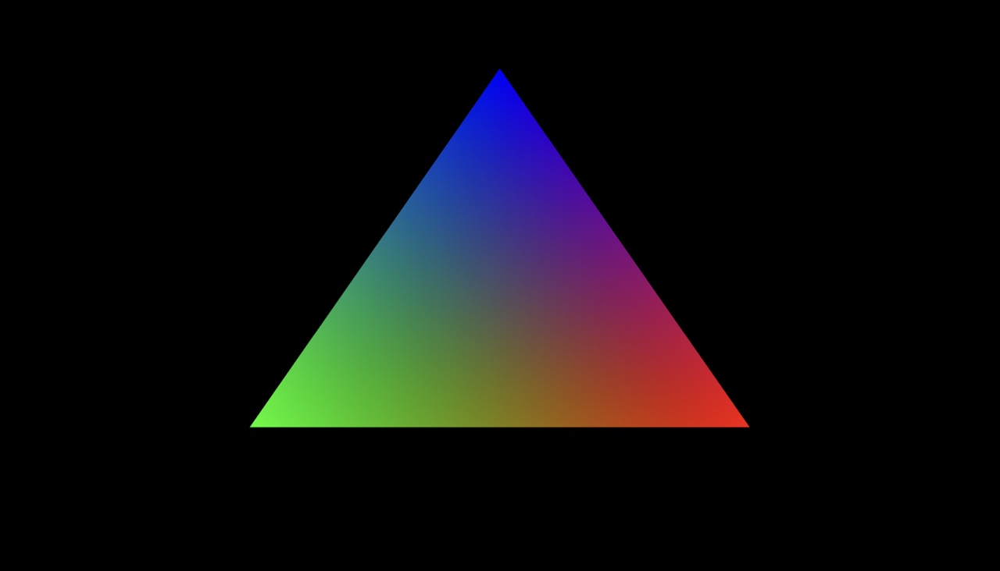</picture> |
| `vertexattributes` | Renders the same indexed mesh through interleaved and separate vertex attribute buffers using matching shader locations for position, normal, UV, and tangent data. | <picture><source srcset="screenshots/vertexattributes.webp" type="image/webp">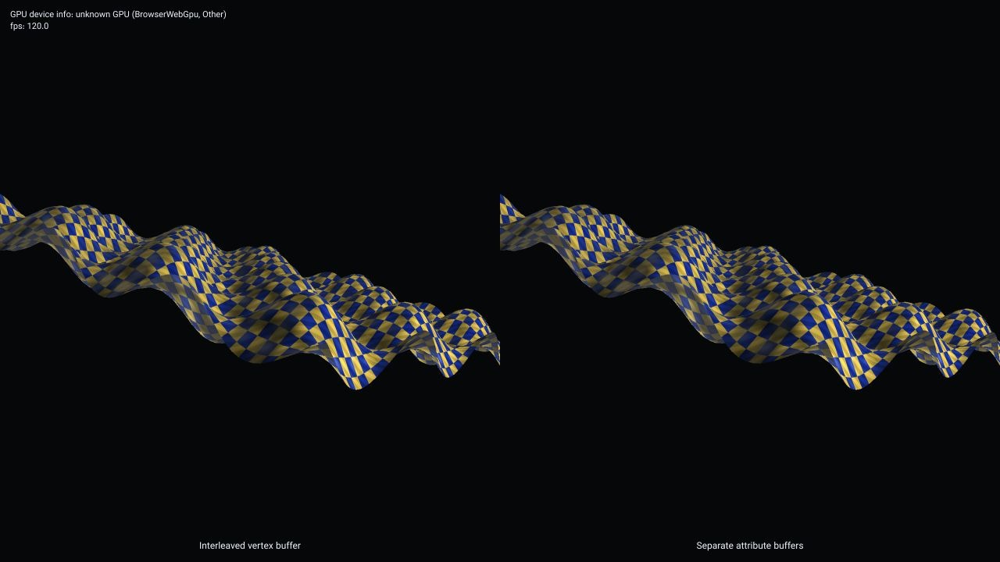</picture> |
| `particlesystem` | Updates flame and smoke particles on the CPU, streams them into an instance buffer, and renders billboard sprites over a normal-mapped scene. | <picture><source srcset="screenshots/particlesystem.webp" type="image/webp">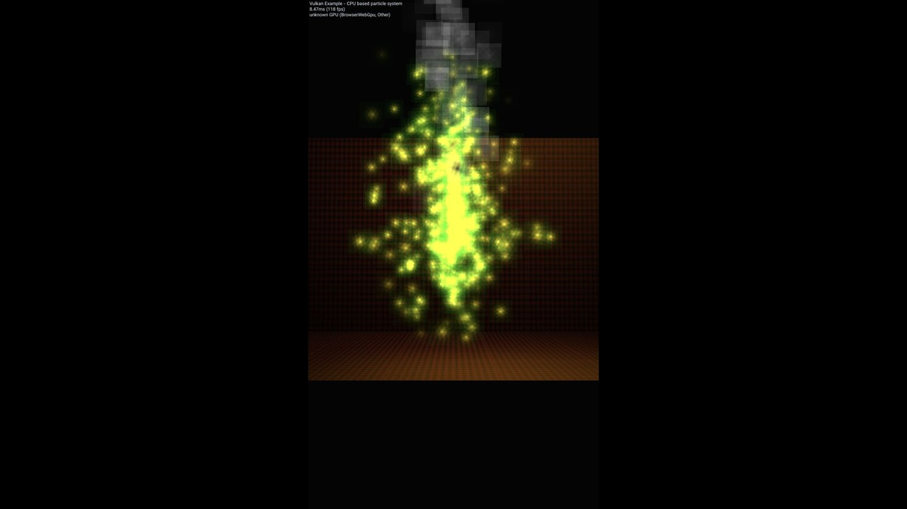</picture> |
| `computeparticles` | Updates 262,144 particle records in 1,024 compute workgroups using ping-ponged storage buffers, then renders the GPU-written state as additive textured billboards. | <picture><source srcset="screenshots/computeparticles.webp" type="image/webp">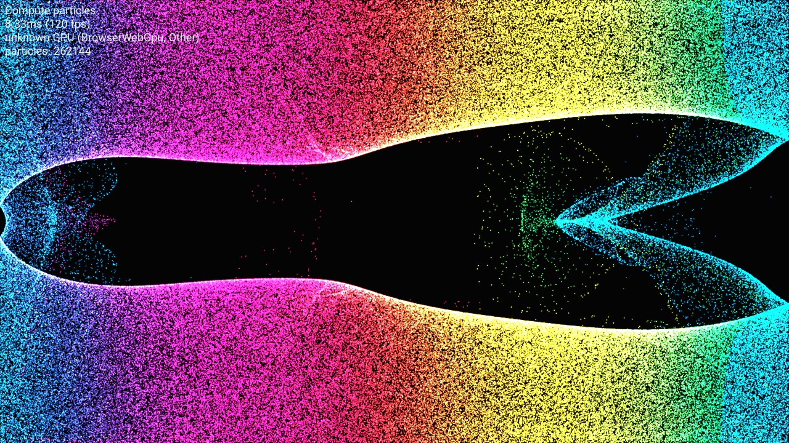</picture> |
| `computecloth` | Simulates a spring-connected cloth grid in compute shaders, ping-pongs storage buffers, collides with a sphere, and renders the GPU-written cloth mesh. | <picture><source srcset="screenshots/computecloth.webp" type="image/webp">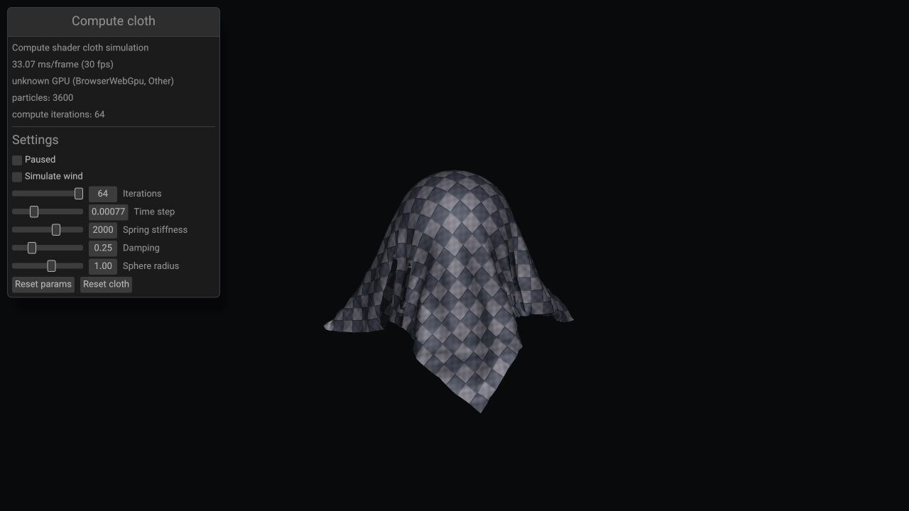</picture> |
| `computecullandlod` | Culls a dense object grid in a compute shader, buckets visible instances by LOD, writes indirect draw commands, and renders the compacted GPU instance buffers. | <picture><source srcset="screenshots/computecullandlod.webp" type="image/webp">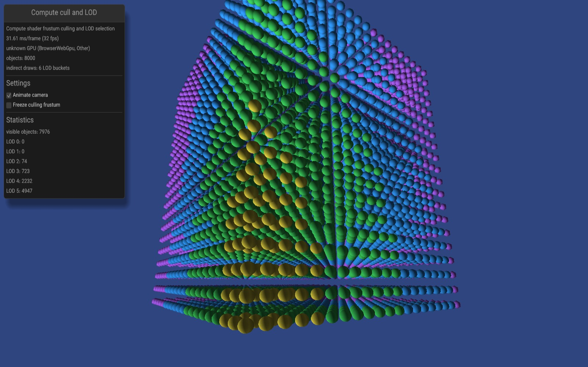</picture> |
| `nanite` | Scales its Jax population to the detected GPU, streams requested geometry pages into a physical cache, selects projected-error meshlet LODs, and performs two-pass HZB occlusion with indirect draws. | <picture><source srcset="screenshots/nanite.webp" type="image/webp">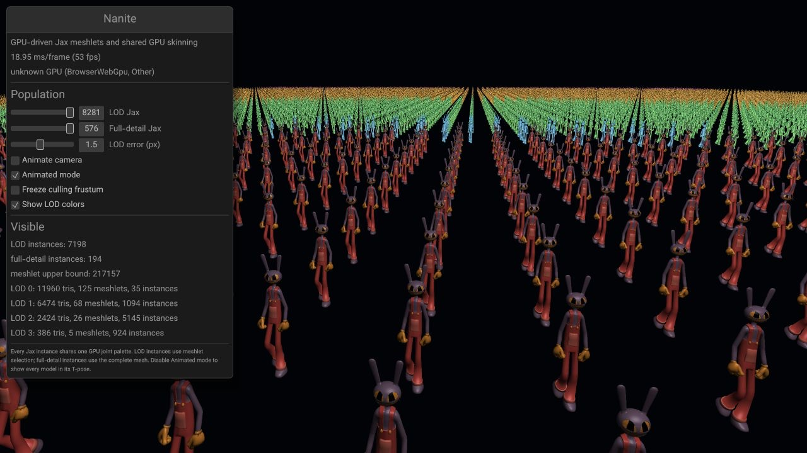</picture> |
| `metropolis` | Renders Sponza with GPU-skinned Jax crowds using clustered Forward+ lighting, compute frustum culling, indirect draws, physics, dynamic shadows, reflections, probe GI, particles, and temporal post-processing. | <picture><source srcset="screenshots/metropolis.webp" type="image/webp">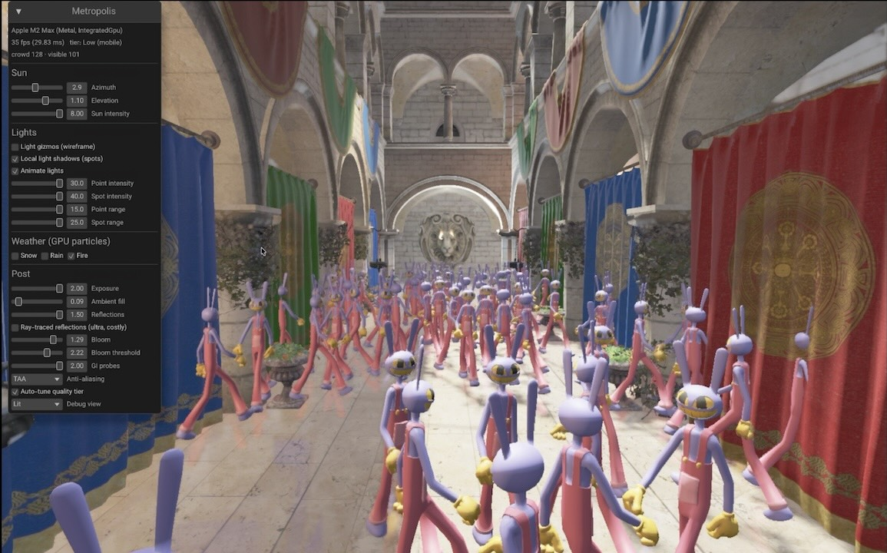</picture> |
| `computenbody` | Evaluates 150,994,944 ordered particle interactions per frame with tiled workgroup memory, integrates one in-place storage buffer, and renders 12,288 additive billboards with runtime egui controls. | <picture><source srcset="screenshots/computenbody.webp" type="image/webp">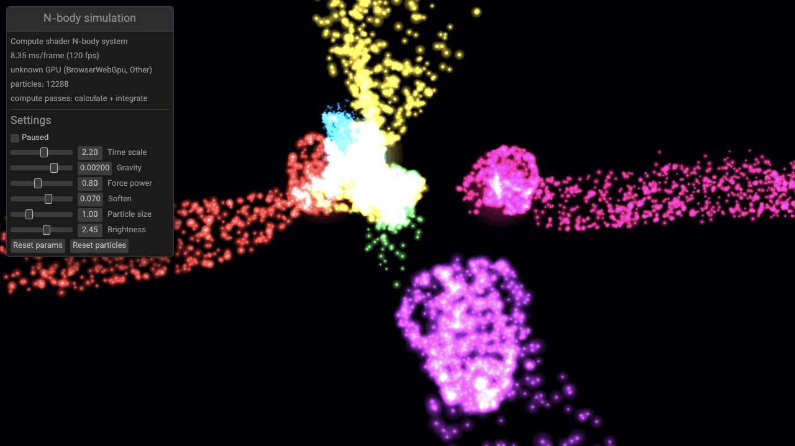</picture> |
| `computeraytracing` | Ray traces spheres and planes in a compute shader, writing the result to a storage texture that is sampled by a fullscreen present pass. | <picture><source srcset="screenshots/computeraytracing.webp" type="image/webp">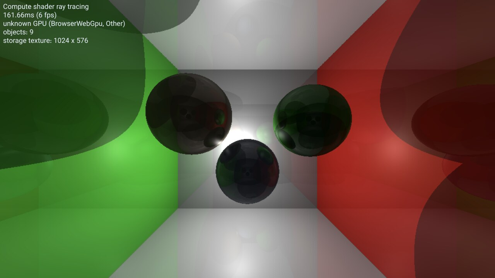</picture> |
| `raytracingshadows` | Casts primary and secondary shadow rays in a compute shader, shading a procedural scene into a storage texture and dimming occluded hits. | <picture><source srcset="screenshots/raytracingshadows.webp" type="image/webp">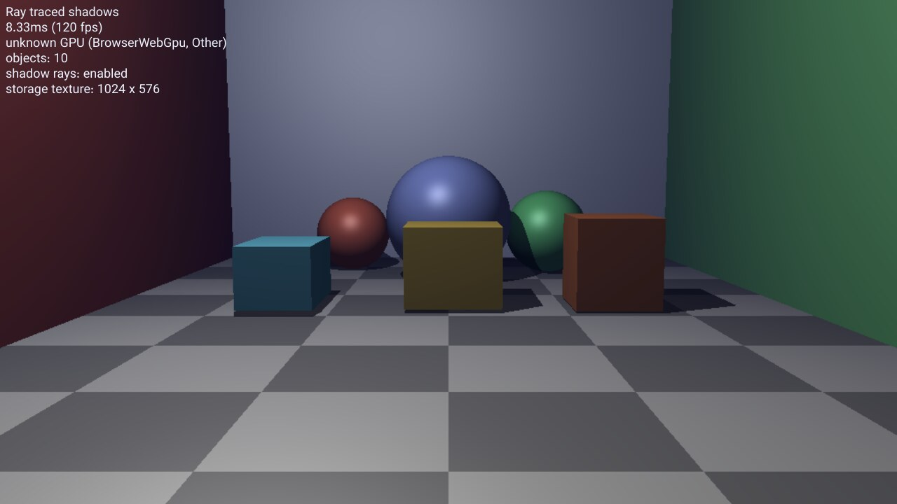</picture> |
| `raytracingreflections` | Traces recursive reflection bounces in a compute shader, treating bright objects as reflectors and falling back to a sky-gradient miss color. | <picture><source srcset="screenshots/raytracingreflections.webp" type="image/webp">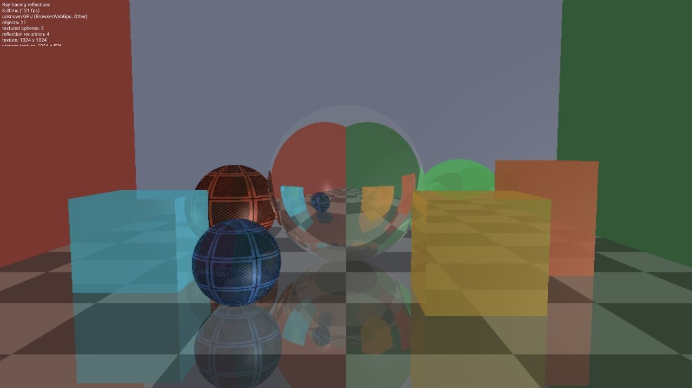</picture> |
| `raytracinggltf` | Ray traces a textured skinned glTF character by flattening animated mesh data into compute-friendly geometry buffers with egui skinning controls and joystick camera movement. | <picture><source srcset="screenshots/raytracinggltf.webp" type="image/webp">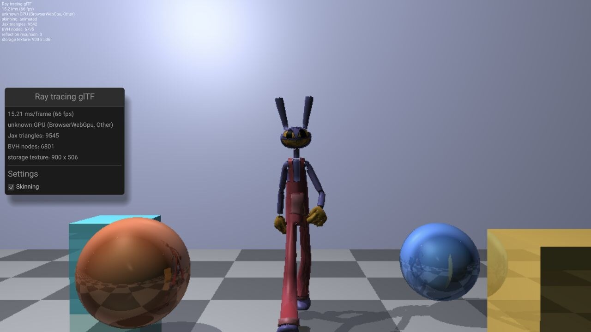</picture> |
| `restirdi` | Resamples direct-light candidates across time and neighboring pixels, tracing visibility through compact static Sponza and dynamic skinned Jax SAH BVHs. | <picture><source srcset="screenshots/restirdi.webp" type="image/webp">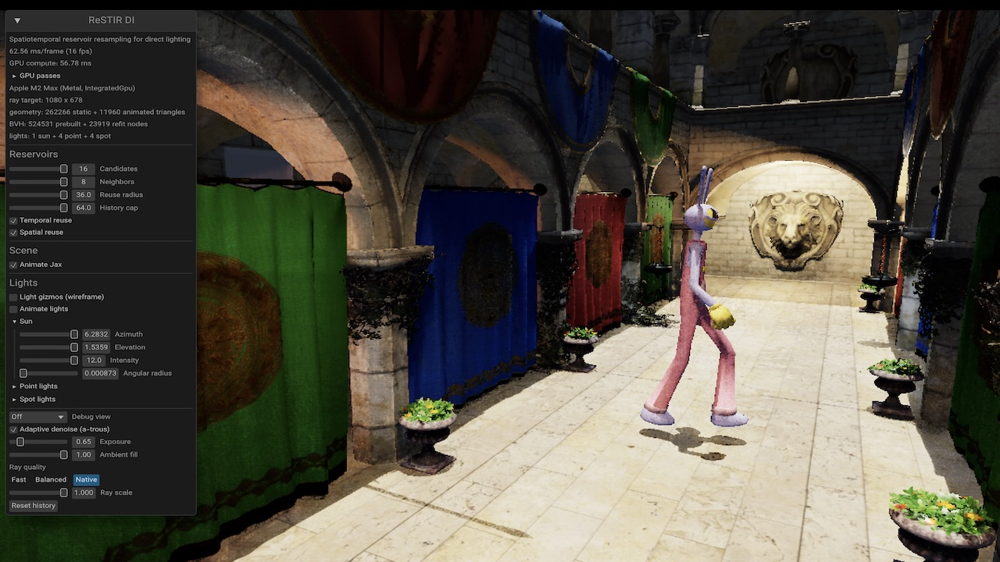</picture> |
| `restirgi` | Reuses one-bounce indirect-light path reservoirs across time and space over the same Crytek Sponza scene and animated Jax character. | <picture><source srcset="screenshots/restirgi.webp" type="image/webp">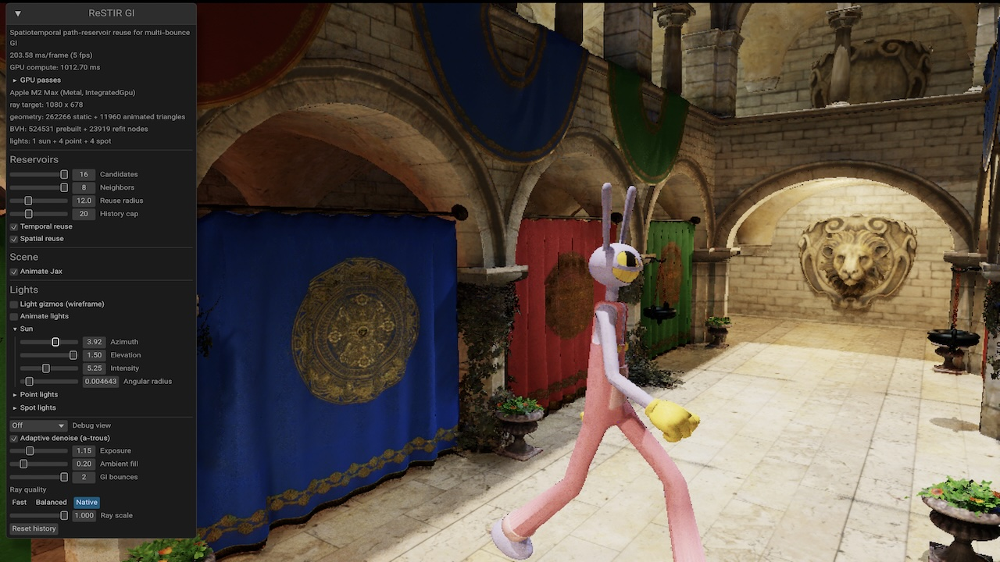</picture> |
| `htmlmesh` | Renders a simple inline HTML button page to an RGBA texture, uploads it to WebGPU, maps it onto a plane, and ray-maps pointer input back to the button. | <picture><source srcset="screenshots/htmlmesh.webp" type="image/webp">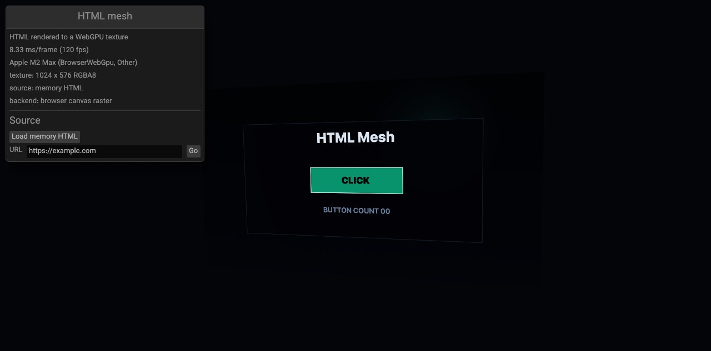</picture> |
| `texture` | Renders a textured indexed quad using a runtime-loaded PNG texture, a sampler, uniform buffer transforms, and fragment shader lighting. | <picture><source srcset="screenshots/texture.webp" type="image/webp">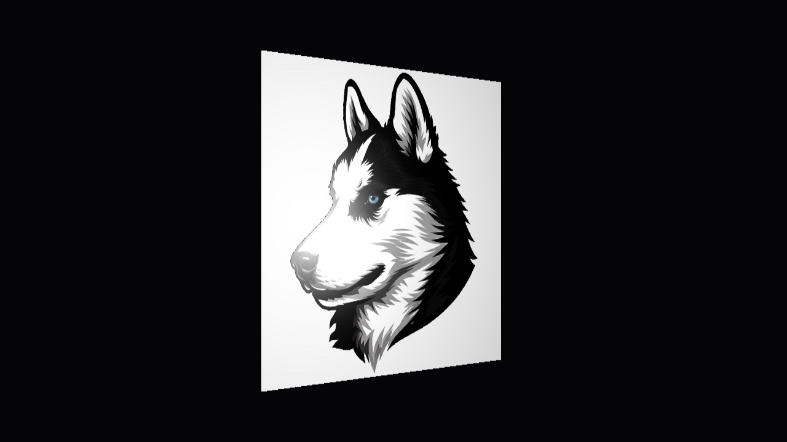</picture> |
| `texturemipmapgen` | Generates a full mip chain from a high-frequency texture using offscreen render passes, then samples the result on a textured tunnel. | <picture><source srcset="screenshots/texturemipmapgen.webp" type="image/webp">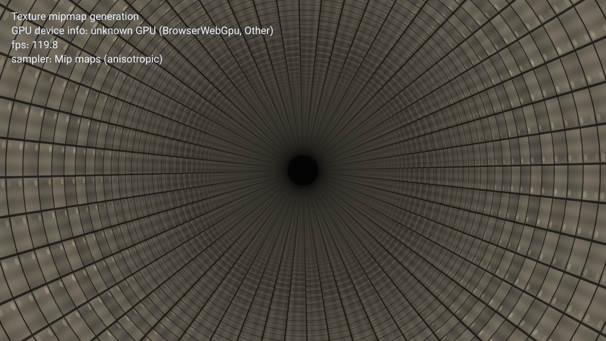</picture> |
| `texturecubemap` | Renders a skybox and reflective sphere from six bundled KTX1 faces loaded at runtime, a cube texture view, and a filtering sampler. | <picture><source srcset="screenshots/texturecubemap.webp" type="image/webp">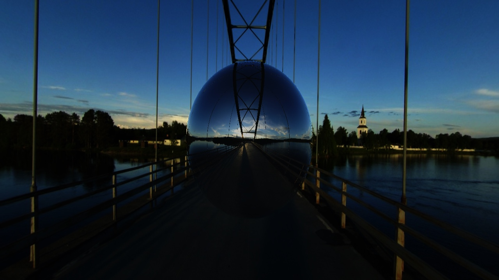</picture> |
| `texturearray` | Renders seven stacked squares sampling separate layers from a runtime-built 2D texture array with two async-loaded images, RGB layers, and procedural layers. | <picture><source srcset="screenshots/texturearray.webp" type="image/webp">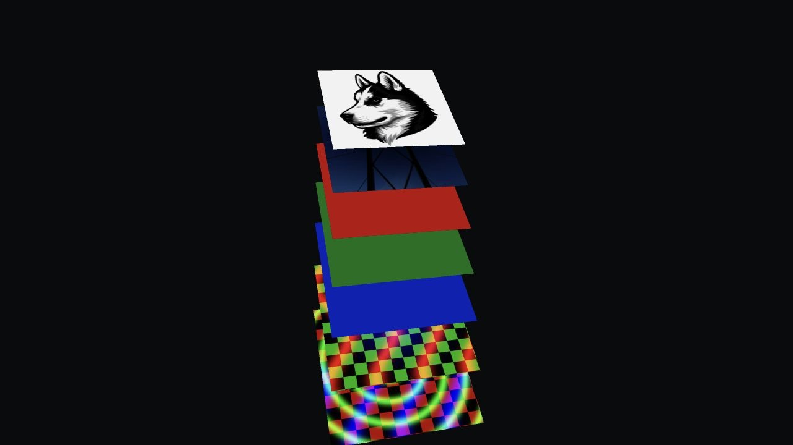</picture> |
| `textoverlay` | Renders glyph atlas text over a 3D scene using an overlay render pass, Unicode shaping, and RTL text. | <picture><source srcset="screenshots/textoverlay.webp" type="image/webp">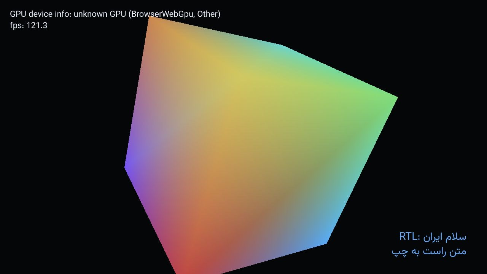</picture> |
| `textmesh` | Converts shaped LTR and RTL font outlines into extruded indexed mesh geometry with vertex colors and lighting. | <picture><source srcset="screenshots/textmesh.webp" type="image/webp"></picture> |
| `gltf` | Loads an official glTF 2.0 textured box from URL, converts buffers and material data to render meshes, and samples its base color texture. | <picture><source srcset="screenshots/gltf.webp" type="image/webp">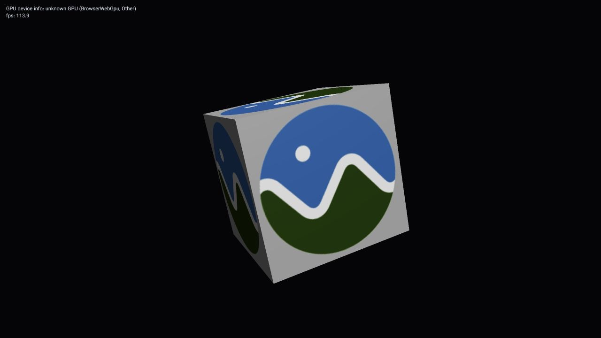</picture> |
| `gltfskinning` | Loads a textured animated glTF 2.0 character, uploads joints and weights, and skins vertices in the WGSL vertex shader. | <picture><source srcset="screenshots/gltfskinning.webp" type="image/webp">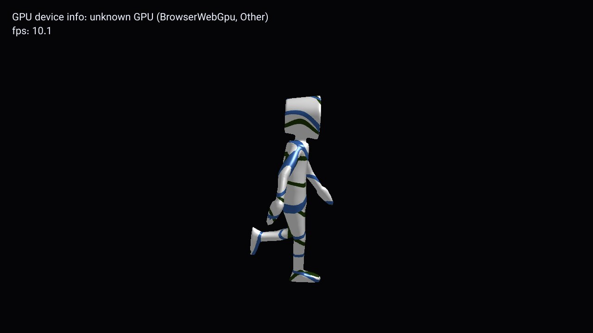</picture> |
| `instancing` | Renders thousands of asteroid instances from one indexed mesh, using a per-instance vertex buffer for transform data and a 2D texture array for material variation. | <picture><source srcset="screenshots/instancing.webp" type="image/webp">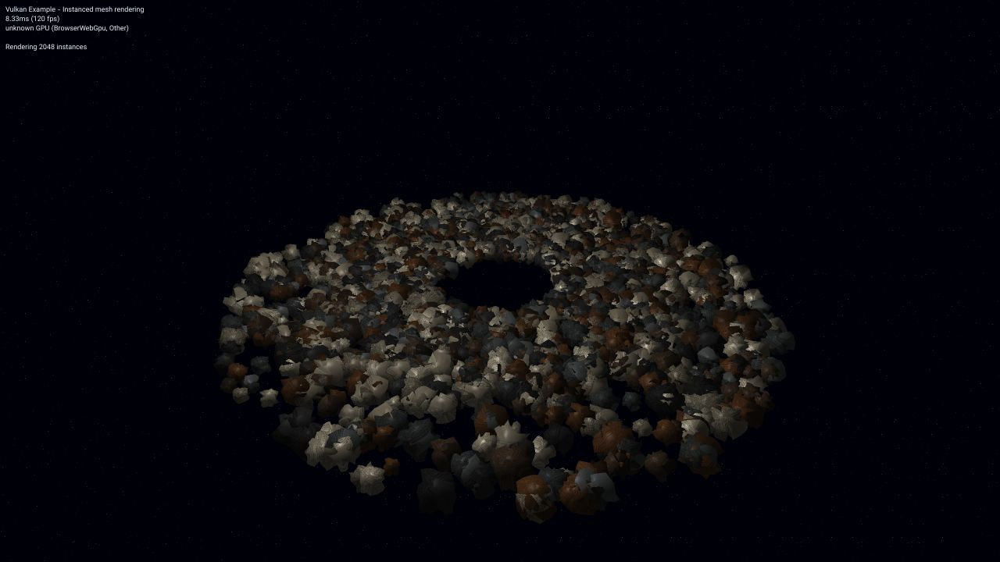</picture> |
| `indirectdraw` | Renders many instanced plant submeshes from indexed indirect command buffers, with a skysphere, ground mesh, and per-instance transforms. | <picture><source srcset="screenshots/indirectdraw.webp" type="image/webp">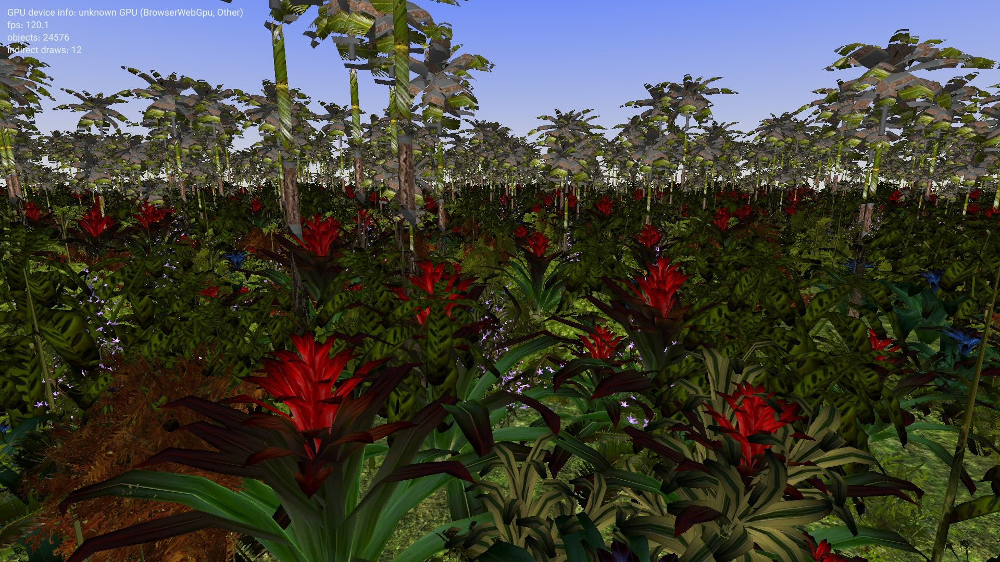</picture> |
| `pipelines` | Renders the original treasure glTF scene through Phong, toon, and wireframe render pipelines in separate viewports. | <picture><source srcset="screenshots/pipelines.webp" type="image/webp">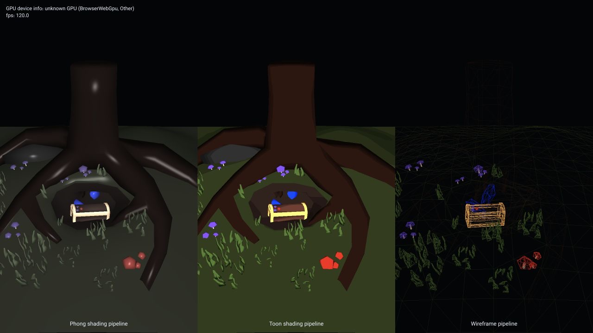</picture> |
| `gears` | Renders animated procedural toothed gears using indexed mesh buffers, per-gear uniform transforms, depth testing, and fragment shader lighting. | <picture><source srcset="screenshots/gears.webp" type="image/webp">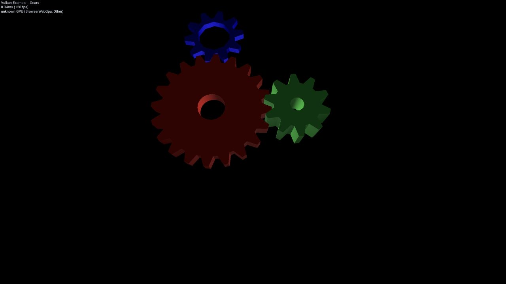</picture> |
| `stencilbuffer` | Renders a toon-shaded Venus mesh, writes stencil during the first draw, then draws a normal-expanded outline where stencil differs. | <picture><source srcset="screenshots/stencilbuffer.webp" type="image/webp">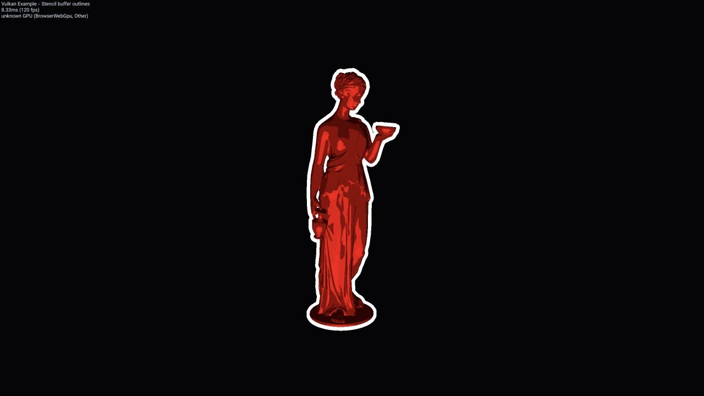</picture> |
| `occlusionquery` | Tests teapot and sphere visibility; native builds resolve occlusion-query samples, while WASM uses a browser-safe fallback and shades hidden meshes dark. | <picture><source srcset="screenshots/occlusionquery.webp" type="image/webp">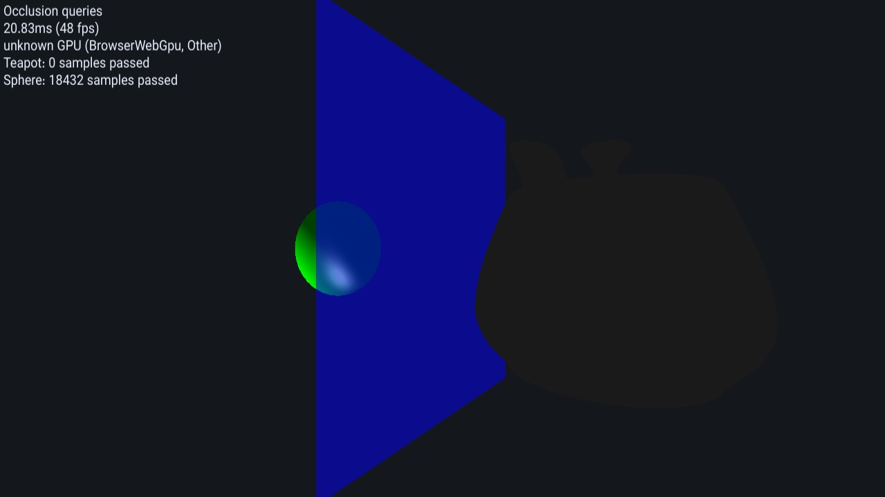</picture> |
| `radialblur` | Renders a glow sphere to an offscreen target, samples it in a fullscreen radial blur pass, and blends the result over the lit scene. | <picture><source srcset="screenshots/radialblur.webp" type="image/webp">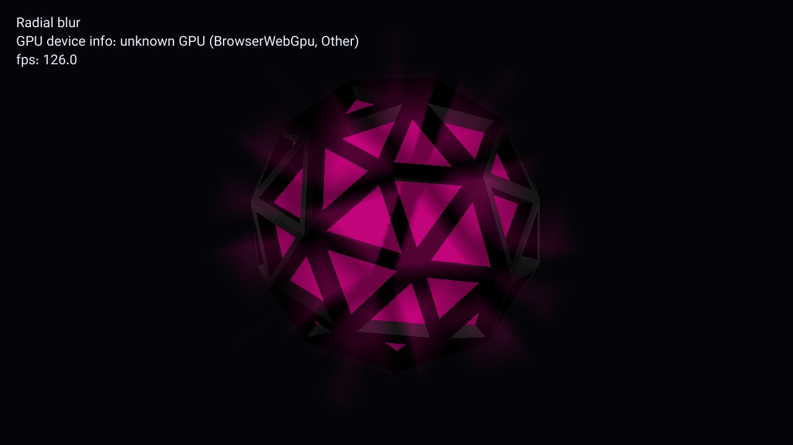</picture> |
| `bloom` | Renders glowing UFO parts to an offscreen target, runs separable Gaussian blur passes, and additively composites the bloom over the lit scene. | <picture><source srcset="screenshots/bloom.webp" type="image/webp">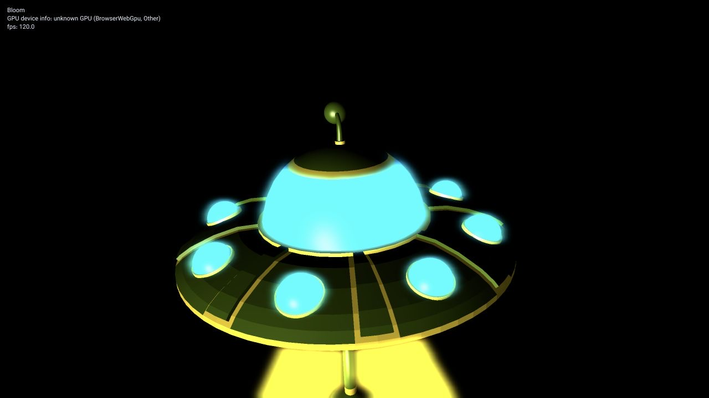</picture> |
| `deferred` | Fills world-position, normal, and albedo G-buffer attachments with an animated skinned Jax character and checkerboard floor, then evaluates six lights in one fullscreen composition draw. | <picture><source srcset="screenshots/deferred.webp" type="image/webp">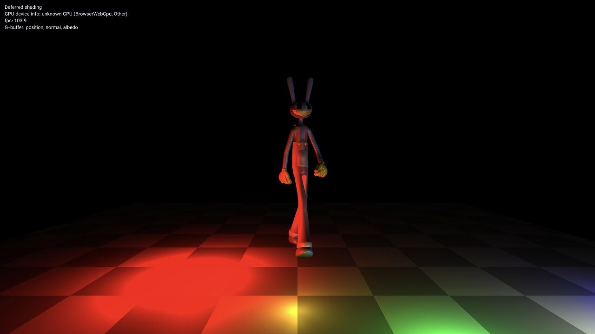</picture> |
| `deferredmultisampling` | Stores four samples per position, normal, albedo, and depth G-buffer pixel, then shades each sample under six lights and averages the result in a single-sample fullscreen pass. | <picture><source srcset="screenshots/deferredmultisampling.webp" type="image/webp">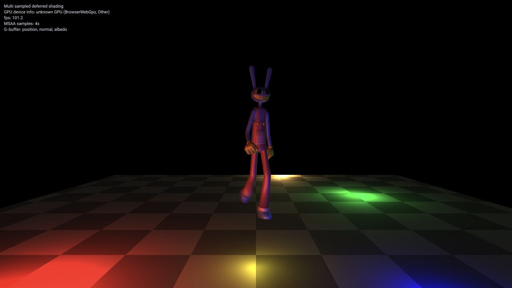</picture> |
| `deferredshadows` | Renders animated Jax into three 1024×1024 `Depth32Float` maps, then evaluates eight spotlights and up to 27 comparison samples in the fullscreen deferred pass. | <picture><source srcset="screenshots/deferredshadows.webp" type="image/webp">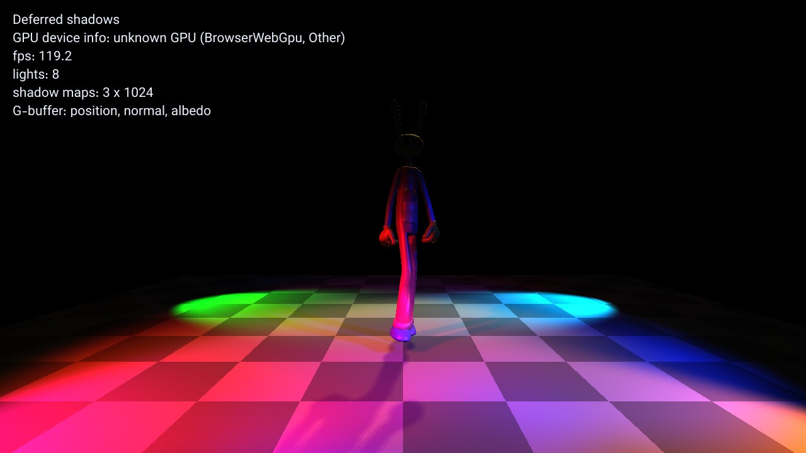</picture> |
| `ssao` | Uses up to 32 screen-space spiral samples from the position, normal, and depth G-buffer, blurs the full-resolution AO mask with a weighted 5×5 kernel, and combines it with deferred shadows. | <picture><source srcset="screenshots/ssao.webp" type="image/webp">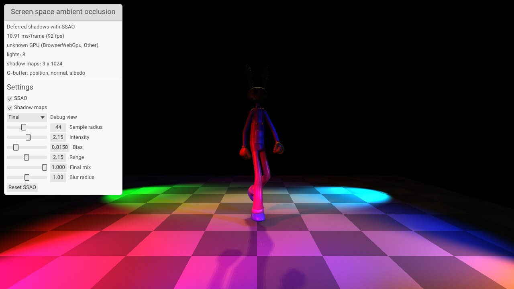</picture> |
| `parallaxmapping` | Ray-marches 48 height layers from a combined normal-height map on a flat two-triangle plane, then refines the UV intersection for parallax occlusion mapping. | <picture><source srcset="screenshots/parallaxmapping.webp" type="image/webp">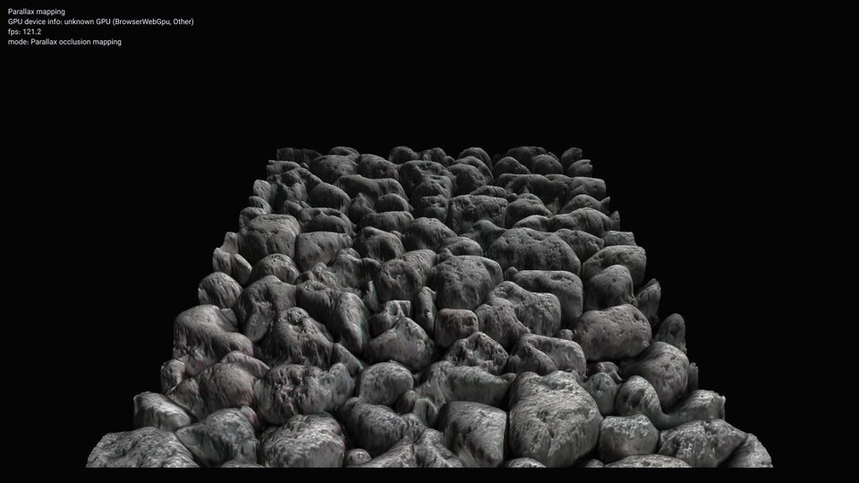</picture> |
| `multisampling` | Renders the textured Voyager in three indexed draws into 4x multisampled color and depth attachments, then resolves once into the surface. | <picture><source srcset="screenshots/multisampling.webp" type="image/webp">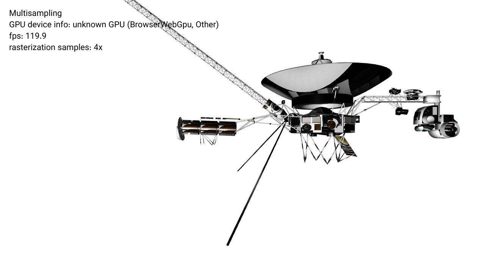</picture> |
| `multisamplingalphatocoverage` | Renders instanced alpha-masked oak trees with 4x MSAA and alpha-to-coverage enabled for smoother foliage edges. | <picture><source srcset="screenshots/multisamplingalphatocoverage.webp" type="image/webp">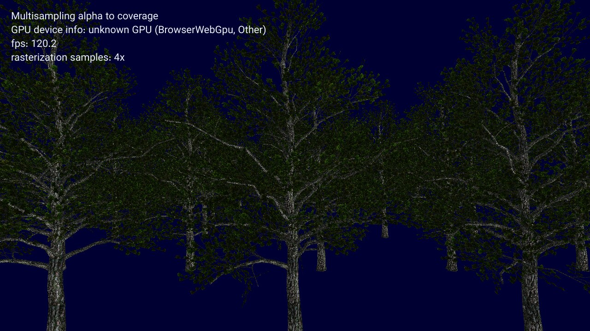</picture> |
| `pbr` | Renders a 7x7 grid of procedural spheres with GGX/Schlick PBR shading, varying metallic and roughness per instance. | <picture><source srcset="screenshots/pbr.webp" type="image/webp">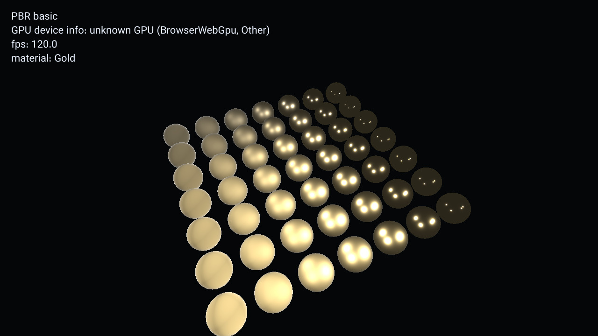</picture> |
| `pbribl` | Samples irradiance, prefiltered environment mips, and a BRDF integration LUT for image-based PBR lighting. | <picture><source srcset="screenshots/pbribl.webp" type="image/webp">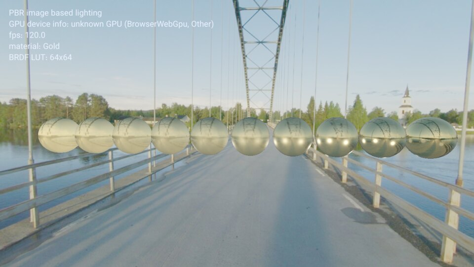</picture> |
| `pbrtexture` | Renders the Cerberus glTF mesh with albedo, normal, AO, metallic, and roughness maps under image-based PBR lighting. | <picture><source srcset="screenshots/pbrtexture.webp" type="image/webp">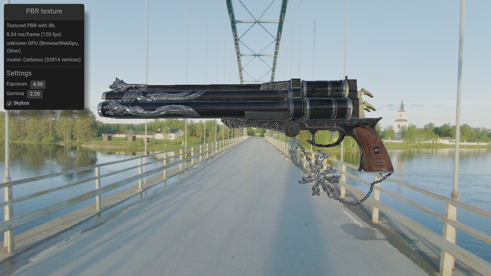</picture> |
| `shadowmapping` | Renders a depth-only light pass into a shadow map, then samples that depth texture in the scene pass for projected shadows with PCF filtering. | <picture><source srcset="screenshots/shadowmapping.webp" type="image/webp">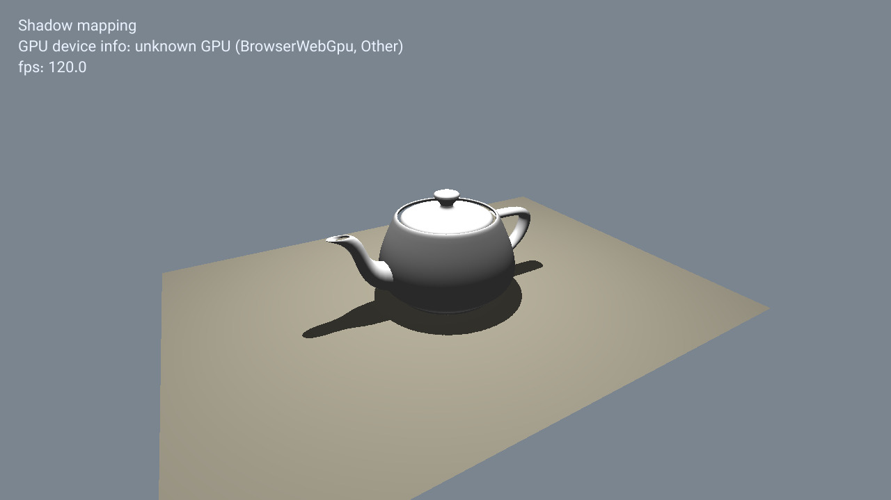</picture> |
| `shadowmappingcascade` | Splits the camera frustum into four cascades, renders each split into a depth texture array layer, and samples the selected layer for directional shadows. | <picture><source srcset="screenshots/shadowmappingcascade.webp" type="image/webp">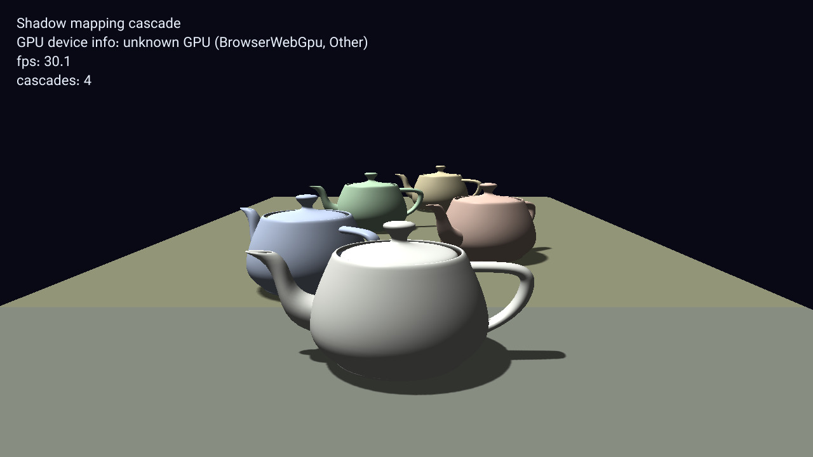</picture> |
| `shadowmappingomni` | Renders the scene into the six faces of a floating-point cube map, stores point-light distance, and samples it for omni-directional shadows. | <picture><source srcset="screenshots/shadowmappingomni.webp" type="image/webp">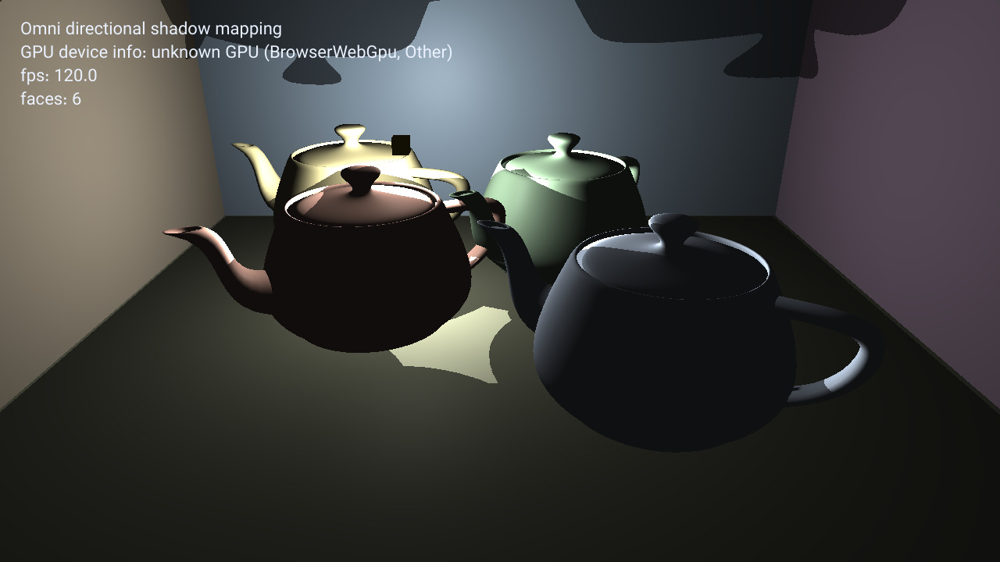</picture> |
| `geometrydash` | Runs an original one-button rhythm platformer with fixed-step physics, procedural GPU geometry, obstacle collisions, jump pads, progress tracking, and responsive mouse, keyboard, and touch controls. This game was created at the request of my son, Ryan, who designed the concept and gameplay inspired by the original Geometry Dash game. | <picture><source srcset="screenshots/geometrydash.webp" type="image/webp">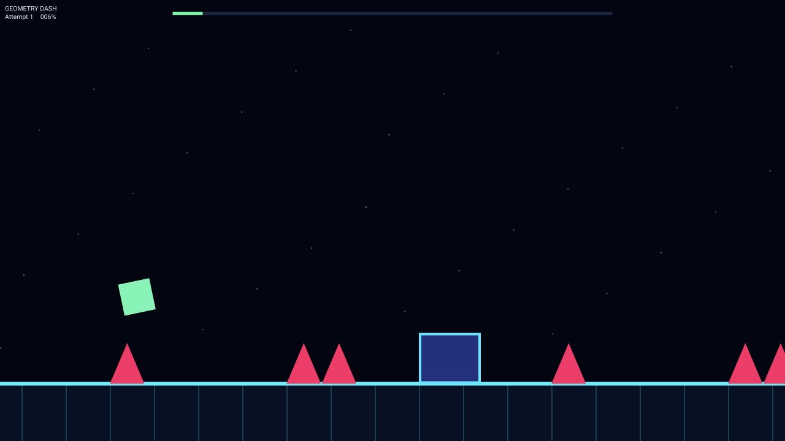</picture> |
| `residentevil2` | Runs Claire outside the R.P.D. with GPU skinning, imported glTF idle, forward-running, and backward-walking animations, persistent tank controls, projected contact shadows, and three classic fixed-camera zones. | <picture><source srcset="screenshots/residentevil2.webp" type="image/webp">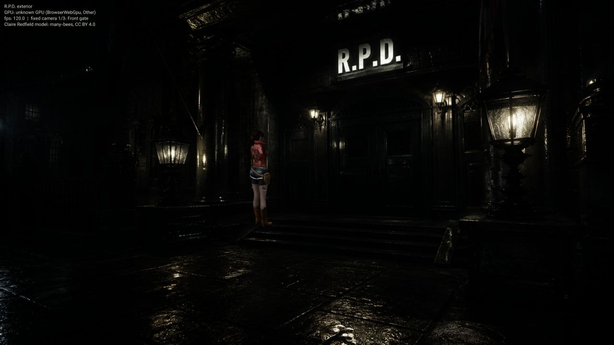</picture> |

The `residentevil2` example uses [Claire Redfield - The Darkside Chronicles](https://sketchfab.com/3d-models/claire-redfield-the-darkside-chronicles-8016829b88aa4cd089e7e2c0c93d898f) by many-bees under [CC BY 4.0](https://creativecommons.org/licenses/by/4.0/).

## ReSTIR acceleration

The ReSTIR examples use `bvh` for the shared native and WASM acceleration structure. A native asset tool builds Sponza's SAH BVH in parallel, serializes compact 32-byte GPU nodes, and commits the versioned result so both platforms load the same hierarchy without rebuilding it at startup. Jax builds its topology once and refits the animated bounds at runtime.

## Running

Native:

```sh
cargo run --example triangle
```

WASM:

```sh
scripts/build-wasm.sh --release
cargo run --bin serve
```

Then open `http://127.0.0.1:8080`.
